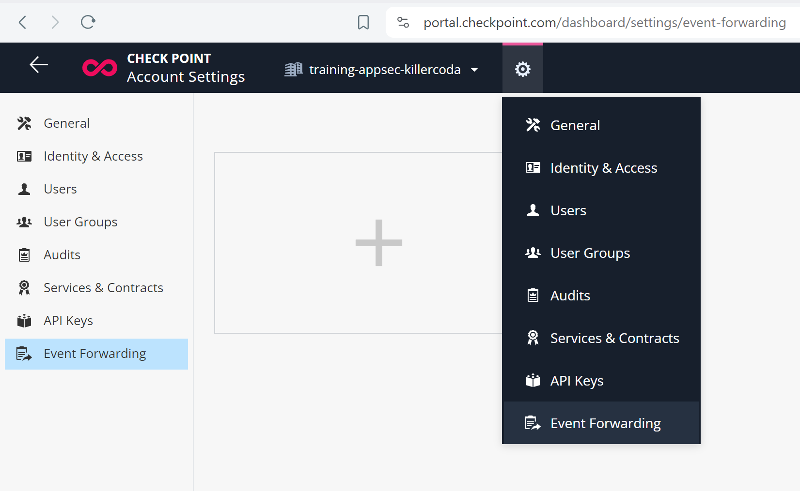
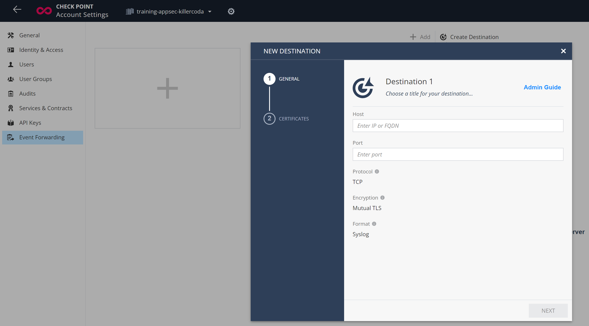
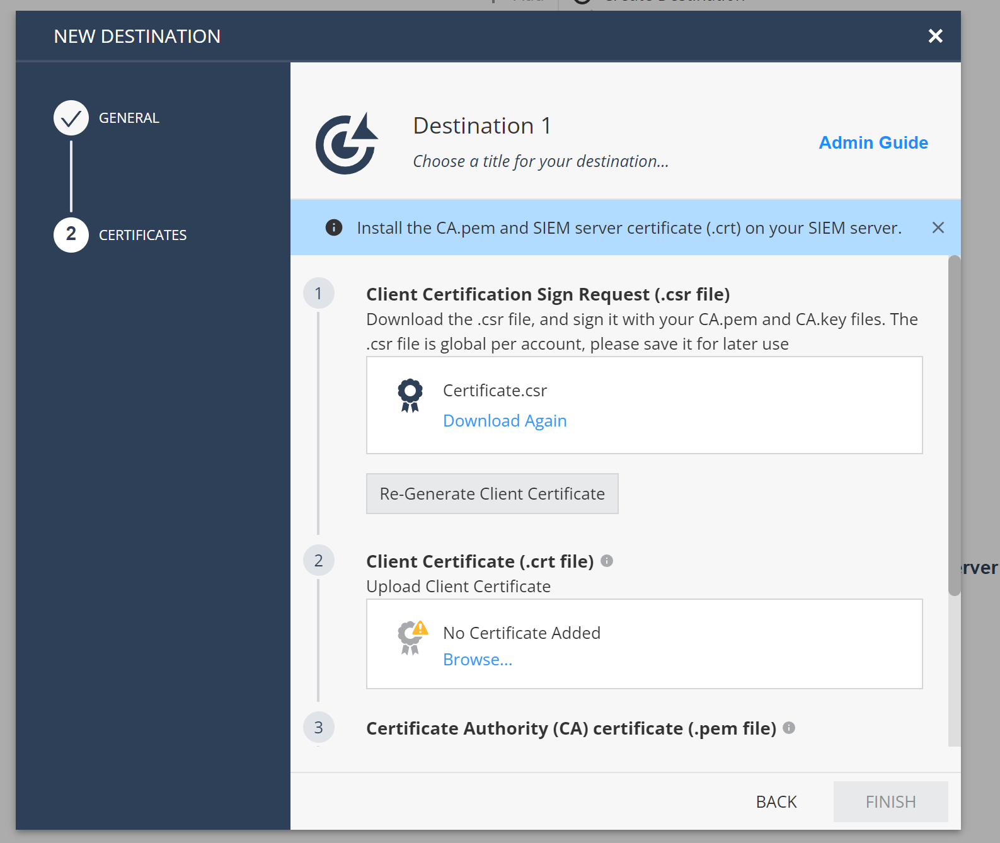
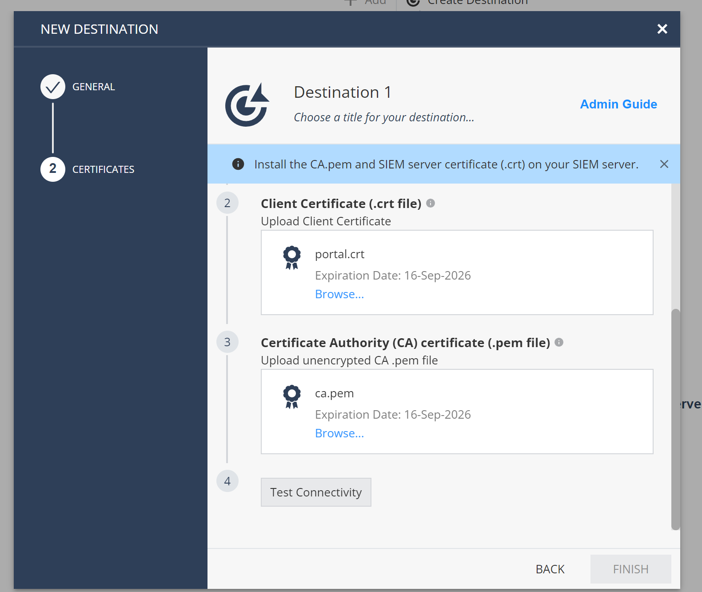
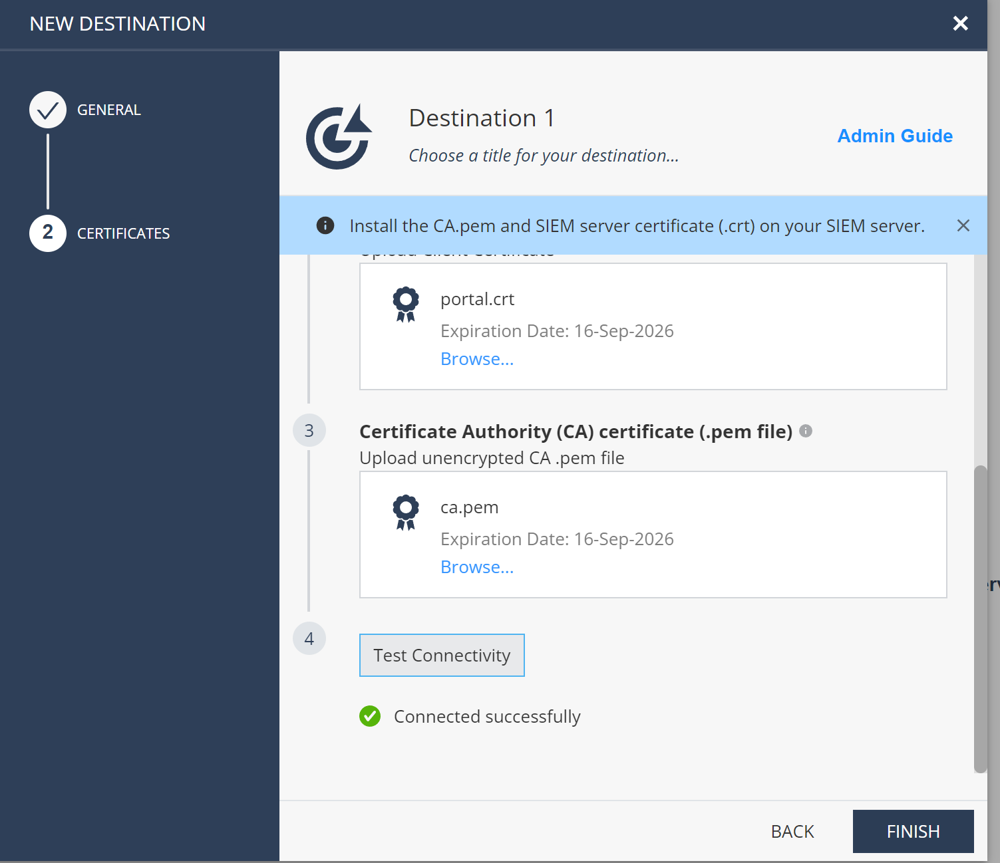

# Logexporter from Security Management and Infinity Portal

```shell
# login to Az
az login
az account list -o table

# workdir
cd /workspaces/tf-playground/57-logexporter

# BUT FIRST make Storage Account for tfstate
cd /workspaces/tf-playground/57-logexporter/tfstate
tf init
tf apply -auto-approve
# see sa params for tfstate:
tf output -raw tfstate_vars
cd ..
code provider.tf

# IMPORTANT 
# cut&paste tfstate parameters from tfstate_vars output to provider.tf
#   under backend "azurerm"  section

# workdir
cd /workspaces/tf-playground/57-logexporter

# once provider.tf backend section was updated!!!
tf init
terraform init -reconfigure

tf apply -auto-approve

# ssh
mkdir -p ~/.ssh
tf output -raw ssh_key > ~/.ssh/logexporter.key
chmod og= ~/.ssh/logexporter.key
tf output -raw ssh_config | tee -a ~/.ssh/config
cat ~/.ssh/config
ssh logexporter -v


# lets establish CA and issue certificate for logexporter vm

ssh logexporter
# logexporter: new CA
cd; mkdir -p ca; cd ca
# logexporter: generate CA key ca.ket
openssl genrsa -out ca.key 2048
# logexporter: and certificate ca.pem
openssl req -x509 -new -nodes -key ca.key -sha256 -days 825 -out ca.pem -subj "/C=US/ST=TX/L=test/O=TestCert/CN=ca"
# logexporter: check certificate
openssl x509 -in ca.pem -noout -text | grep CN

# logexporter: key for server and cert issued by our CA
# logexporter: generate server.key
openssl genrsa -out server.key 2048
# logexporter: server public IP
export SERVERIP=$(curl -s ip.iol.cz/ip/); echo "Server IP is ${SERVERIP}"
# logexporter: server.crt via CSR
openssl req -new -key server.key -out server.csr -subj "/C=US/ST=TX/L=test/O=TestCert/CN=${SERVERIP}"
# logexporter: sign server.crt
openssl x509 -req -in server.csr -CA ca.pem -CAkey ca.key -CAcreateserial -out server.crt -days 825 -sha256
# logexporter: check subject
openssl x509 -in server.crt -text -noout | grep CN

# logexporter: start temporary service; do not check client certs.
sudo apt install socat -y
cd; cd ca
socat - OPENSSL-LISTEN:6514,verify=0,cert=server.crt,key=server.key,cafile=ca.pem

# CODESPACE: connect remotely with TLS
# remember - SERVERIP above?
export SERVERIP=13.94.184.173
openssl s_client -connect $SERVERIP:6514 
# check output inludig TLS ver, certificate
# type few characters to see them on server side
# it works from server to client too ;-)


# Infinity Portal log exporter setup
# CTRL-C on logexporter VM as well as on Codespace client
```
Choose relevant Infinity Portal tenant
and visit Global Settings / [Event Forwarding](https://portal.checkpoint.com/dashboard/settings/event-forwarding)



Lets add new destination - our logexporter VM. Remember `SERVERIP` above, right? Port is 6514.



Download CSR Certificate.csr, but save it on disk as (rename to) `portal.csr`
Did you know that Cut&Paste works for files between your computer and Codespace in VSCODE? Paste file to `57-logexporter` folder.



Lets sign cert for portal:
```shell
# CODESPACE: upload CSR to logexporter VM
cd /workspaces/tf-playground/57-logexporter
scp portal.csr logexporter:~/ca/
# CODESPACE: back to logexporter VM
ssh logexporter
# logexporter: sign CSR for portal side
cd; cd ca;
# logexporter: portal.csr -> portal.crt
openssl x509 -req -in portal.csr -CA ca.pem -CAkey ca.key -CAcreateserial -out portal.crt -days 825 -sha256
# logexporter: check cert
openssl x509 -in portal.crt -noout -text | grep CN
# logexporter: back to codespace
exit

# CODESPACE: download portal.crt and ca.pem to codespace
cd /workspaces/tf-playground/57-logexporter
scp logexporter:~/ca/ca.pem .
scp logexporter:~/ca/portal.crt .

# right click ca.pem (and portal.crt) in VSCODE and Download back to your computer

```

Finish setup by uploading portal.crt and ca.pem back to Export Events configuration wizard:


We need to start socat on server 6514 before we test connection:

```shell
# back to VM
ssh logexporter
# lpgexporter: start service
cd; cd ca
socat - OPENSSL-LISTEN:6514,verify=0,cert=server.crt,key=server.key,cafile=ca.pem

```

Portal confirms connection success, if it works:


and server(socat) should receive test log line:
```
<14>1 2024-06-13T12:24:06.087644+00:00 Checkpoint Eventforwarding-42eea5a9-6f8d-4582-95b9-0fbca476 1 - - Checkpoint Event-Forwarding connectivity test
```

Lets replace ad-hoc socat receiver with permanent solution - telegraf (metrics and logs processor from InfluxData).

```shell
# CODESPACE: back to logexporter VM
ssh logexporter

# logexporter: install telegraf
sudo apt update; sudo apt install telegraf -y

# copy certs
sudo cp ~/ca/ca.pem /etc/telegraf/
sudo cp ~/ca/server.key /etc/telegraf/
sudo cp ~/ca/server.crt /etc/telegraf/
sudo chmod 644 /etc/telegraf/ca.pem
sudo chmod 644 /etc/telegraf/server.key
sudo chmod 644 /etc/telegraf/server.crt

# logexporter: test with minimal config
cat << EOF | tee ~/telegraf-minimal.conf
  [[outputs.file]]
    files = ["stdout"]

  [[inputs.socket_listener]]
    service_address = "tcp://:6514"
    tls_cert = "/etc/telegraf/server.crt"
    tls_key  = "/etc/telegraf/server.key"
    ## Enables client authentication if set.
    tls_allowed_cacerts = ["/etc/telegraf/ca.pem"]
    data_format = "value"
    data_type = "string"
EOF

# logexporter: start it
telegraf --config ~/telegraf-minimal.conf --debug

# now revisit Infinity Portal / Export Events
# edit destination and under Certificates click Test connectivity again
# you should receive log into telegraf


# logexporter: test with minimal config as service
# notice logging to /var/log/telegraf/portal.log
sudo touch /var/log/telegraf/portal.log
sudo chownm _telegraf:_telegraf  /var/log/telegraf/portal.log

cat << EOF | sudo tee /etc/telegraf/telegraf.conf
  [[outputs.file]]
    files = ["/var/log/telegraf/portal.log"]

  [[inputs.socket_listener]]
    service_address = "tcp://:6514"
    tls_cert = "/etc/telegraf/server.crt"
    tls_key  = "/etc/telegraf/server.key"
    ## Enables client authentication if set.
    tls_allowed_cacerts = ["/etc/telegraf/ca.pem"]
    data_format = "value"
    data_type = "string"
EOF

# run as service
sudo  systemctl stop telegraf
sudo  systemctl start telegraf
sudo  systemctl status telegraf
sudo journalctl --no-pager -u telegraf

# logexporter: what is coming
sudo tail -f /var/log/telegraf/out.log
# test connectivity from portal again
```


```shell
# cleanup
cd /workspaces/tf-playground/57-logexporter
tf destroy -auto-approve
cd  /workspaces/tf-playground/57-logexporter/tfstate
tf destroy -auto-approve
```